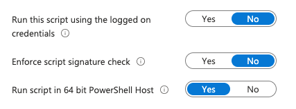

**This script enables the firewall for both Windows and Mac.**

By default, macOS ships with the firewall turned off, while the Windows firewall is enabled out of the box.

When the firewall is managed through Intune MDM, the settings become enforced and locked — meaning users can no longer temporarily disable the firewall or modify its configuration. This can be problematic in certain workflows, especially for developers who may need to adjust firewall settings temporarily for testing, development, or local networking.

To address this, I’ve created a script that re-enables the firewall at a defined interval (configurable via Intune). This allows developers the flexibility to temporarily turn off or modify the firewall without compromising long-term security, as the script ensures it is automatically re-enabled at regular intervals.

Intune Admin Center -> Devices -> macOS -> Scripts

The frequency setting for script execution in Windows Intune is not directly accessible, so I can’t guarantee how often the script is pushed. However, the main purpose of this solution is to serve as a fallback — ensuring that if a user forgets to turn the firewall back on, it will eventually be re-enabled. It’s not a perfect solution, but having something in place is better than having nothing at all.

Intune Admin Center -> Devices -> Windows -> Scripts and remediations -> Platform scripts

