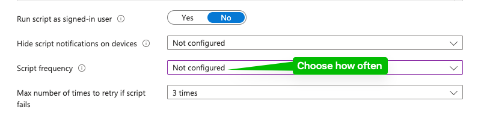

This script turns on the firewall. 
MacOS comes with the firewall turned off. If the firewall is turned on trough the Intune settings category or the Endpoint security section the setting becomes permanent and is not configurable by the user. Such as turning the firewall off or changing the settings during a short time, to be able to do work related things. The users i am talking about is developers.

For this i have made a script that turns on the firewall with a desired frequency ( Choose how often in Intune) so that the developer doesnt forget.

Intune Admin Center -> Devices -> macOS -> Scripts

