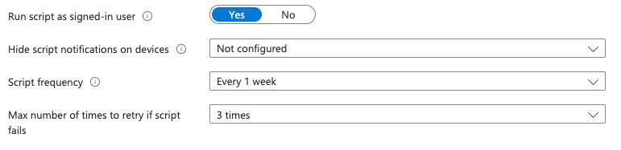

These scripts create shortcuts on the desktop. They are compatible with Intune deployment.

**MacOS**

Intune Admin Center -> Devices -> macOS -> Scripts

**Windows**

Intune Admin Center -> Devices -> Windows -> Scripts and remediations -> Platform scripts

